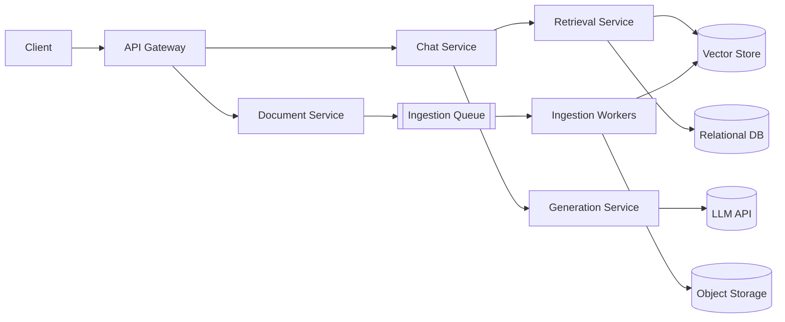
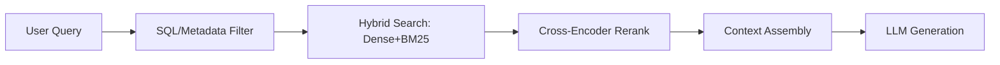
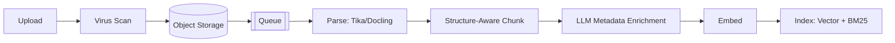
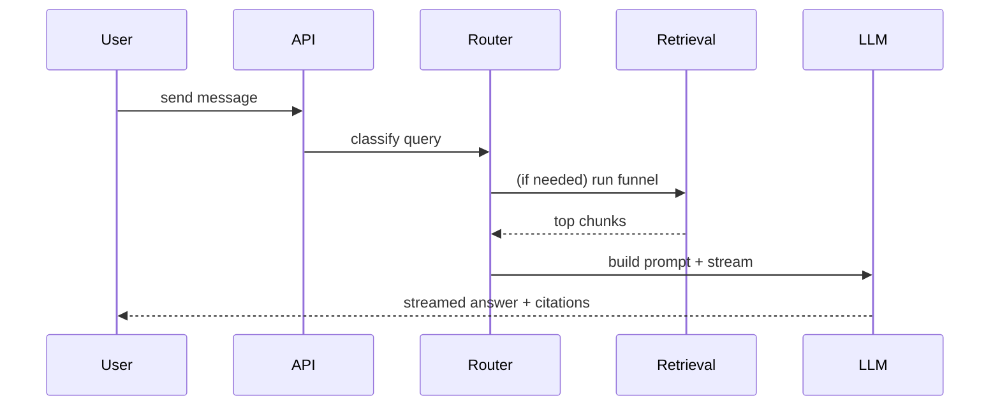
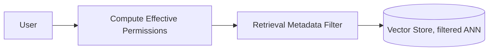
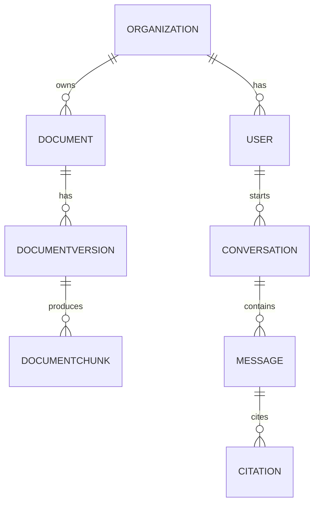
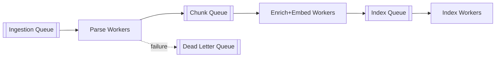
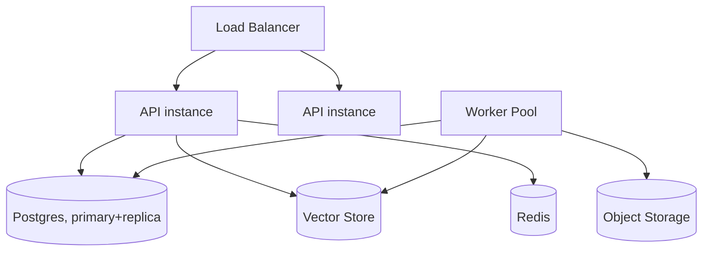
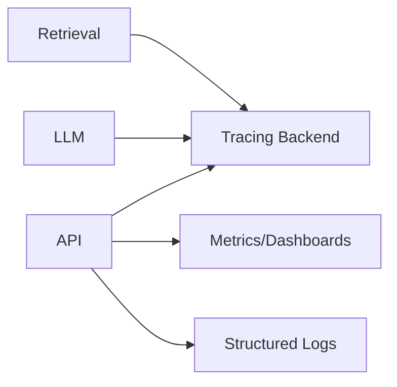
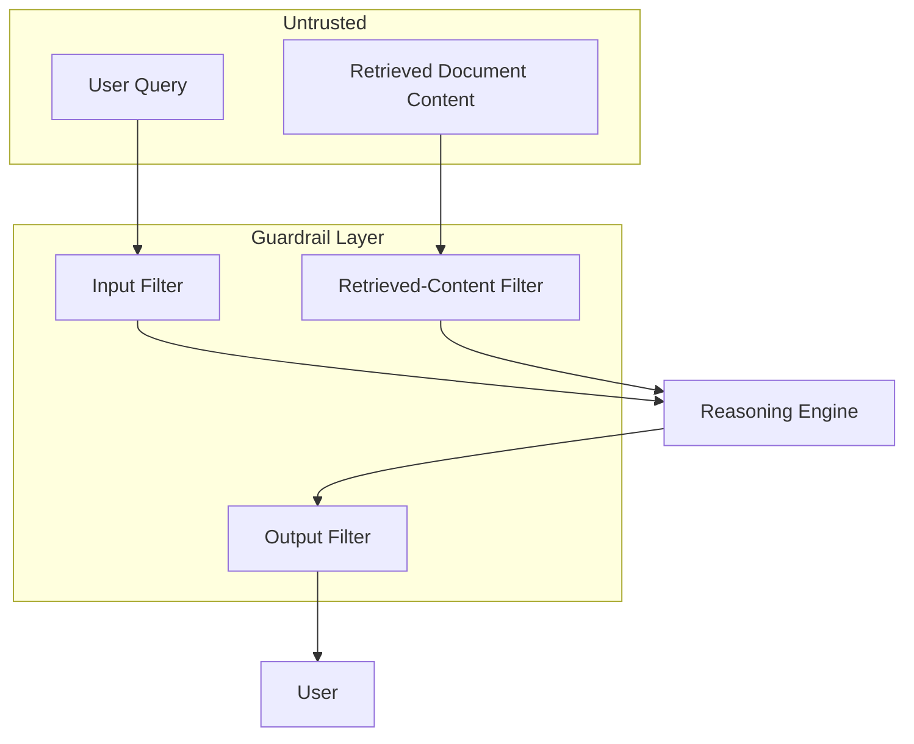

# RAG Chat Application — System Architecture & Implementation Blueprint

> **Implementation status note (read this first):** This document describes the
> full target architecture, including Production-V1 and Scale-phase features
> (multi-agent orchestration, self-correction loops, continuous red-teaming,
> hybrid BM25+dense search, async queue-based ingestion, Postgres+pgvector).
> The actual codebase in this repository implements the **MVP phase only**
> (Phase 1–4 in Section 28's roadmap): auth, document upload/ingestion,
> single-pass retrieval + generation with citations, and chat persistence.
> Every deliberate scope reduction is called out with a comment in the
> source file where it applies, referencing the relevant section below.
> See `README.md` for exactly what exists and how to run it.

*Architecture review of the "RAG at 10 Million Documents" diagram set, expanded into a full production architecture plan. No implementation code included, per your request.*

---

## 1. Executive Architecture Summary

Your diagrams describe an **enterprise-scale, permission-aware RAG system** built around three ideas that are already architecturally sound:
retrieval as a **funnel** (SQL filter → hybrid search → re-rank), **format-agnostic ingestion** via Apache Tika/Docling, and a **defended, self-correcting reasoning layer** (router → multi-agent → evaluation → red-teaming). This is a more mature design than most "RAG tutorial" architectures — it already treats security filtering as a first-class retrieval stage, not an afterthought, and it already assumes the LLM will be wrong sometimes (self-correction, human validation, red-teaming).

What it does **not** yet show: the conversational/chat layer (threads, message persistence, streaming to a UI), the async ingestion job system, the data-layer schema, observability/tracing, deployment topology, cost controls, and multi-tenant boundaries below the "permitted subset" concept. Those are the gaps this document fills in.

The recommended shape is: a **stateless API layer**, a **queue-driven ingestion pipeline**, a **relational DB as the source of truth for permissions and conversations**, a **vector store + BM25 index for retrieval**, and a **reasoning layer that starts as a single well-designed RAG pipeline** (query → filter → hybrid search → rerank → generate) with the router/multi-agent/self-correction layers added only once the simple pipeline is measurably insufficient.

---

## 2. Requirements Identified (from your diagrams + prompt)

- Ingest arbitrary file types (PDF, DOCX, CSV, images) through a single normalization layer (Apache Tika / Docling).
- Preserve document structure during chunking (tables, headings, boundaries) rather than naive fixed-size splitting.
- Enrich chunks with LLM-generated metadata (summaries, keywords, synthetic questions) at ingestion time to speed up retrieval later.
- Retrieval must combine **permission filtering**, **hybrid (dense + sparse) search**, and **re-ranking** — explicitly staged as a funnel (10M → 100K → 100 → 5).
- Support both a simple pipeline and an **agentic** path (planner, tool execution, multi-agent specialists) for complex queries, with a **conditional router** deciding which path a query takes.
- Include **self-correction** (draft → evaluate confidence → retry a different strategy).
- Include **adversarial testing / red-teaming** (prompt injection, information evasion, biased-opinion probes) using tools like Garak, Lakera, PyRIT, NeMo Guardrails, continuously, not just pre-launch.
- Include **human validation** roles (Gatekeeper, Auditor, Strategist) and an **evaluation layer** (LLM-as-judge, precision/recall, latency/cost) with a feedback loop back into routing policy.
- Operate at "10 million documents" scale — i.e., the design must not assume a toy dataset.

## 3. Assumptions

State these explicitly because your diagrams don't specify them — they need to be confirmed before implementation:

- **Cloud-agnostic**, no specific provider assumed (per your rules). Examples below are illustrative, not prescriptive.
- **Multi-tenant B2B** style permissioning is assumed (`security_label`, `dept`, `created_at` fields visible in your relational-DB diagram) rather than pure single-user chat. If this is actually a single-user/consumer app, Section 11 (Auth) simplifies significantly — flag this as an open question.
- LLM and embedding models are **API-based** (not self-hosted), consistent with using Cohere for re-ranking in your diagrams. Self-hosting is a "Scale" concern, not MVP.
- "10 million documents" is a **target scale**, not day-one scale — the MVP architecture below is deliberately simpler and designed to scale into this, not built at this size from day one.
- Chat UI, streaming, and conversation persistence are in scope even though your diagrams focus on the RAG/retrieval side — a "RAG chat application" implies them.

---

## 4. Analysis of Each Diagram

### 4.1 "The Full Map of RAG" (overview)
**Components:** Data sources → Ingestion (parse/chunk/metadata) → Multi-agent system → Retrieval funnel ← Database layer (vector + relational) → Reasoning engine (planner/tool-exec/router) ← Red-teaming → Human validation → Evaluation, with two feedback loops (strategist feedback into routing policy; continuous evaluation into red-teaming).
**What it does well:** Treats evaluation and red-teaming as **continuously running**, not launch gates — the feedback arrows are the most important detail in the whole diagram. Retrieval is explicitly staged, not a single vector lookup.
**Missing:** No chat/session layer, no ingestion job orchestration (queue/workers/retry), no explicit vector-DB choice or sharding strategy, no cost or latency budget attached to the agent path, no mention of what happens when a document is deleted or updated (index invalidation).
**Bottleneck risk:** The multi-agent system sits *before* the retrieval funnel in the diagram's left-to-right flow, which is ambiguous — agents typically need retrieval results to act on. This ordering should be clarified (see Section 22, open question #1).
**Security risk:** Human validation and red-teaming are drawn as siblings to the reasoning engine but nothing in the diagram enforces that a request *must* pass through them — this needs to be an architectural guarantee (middleware/interceptor), not a suggestion.

### 4.2 Apache Tika normalization layer
**Components:** Any file type in → Tika (OCR → Parse → Normalize) → clean text + metadata out, "one clean interface."
**Good:** Centralizing format handling avoids N-parsers-for-N-formats sprawl.
**Missing:** No mention of file-size limits, malware/virus scanning before parsing, or a fallback when Tika fails on a corrupt/exotic file. No versioning of the normalized output (if Tika/Docling is upgraded, do old documents get re-processed?).
**Reliability risk:** Tika is a single normalization chokepoint — if it's synchronous in the request path, a slow/large PDF blocks ingestion throughput. It must run as an **async worker**, which your later diagrams imply but don't state.

### 4.3 Structure-aware chunking ("Words vs Shape", Table Preserver)
**Components:** Tika (raw text) + Docling (PDF layout) feed a chunker that preserves "shape" — typed elements, atomic tables — instead of blind character splitting.
**Good:** This directly addresses a real, common RAG failure mode (tables and structured data destroyed by naive chunking).
**Missing:** No chunk-size/overlap parameters, no strategy for very long documents (parent-child chunking, hierarchical summarization), no chunk versioning tied to a document version.
**Scalability risk:** Table-preserving chunking is more compute-expensive per document than naive chunking — at 10M documents this cost needs explicit budgeting (Section 18).

### 4.4 Metadata enrichment (LLM Metadata Extractors: Summary, Keywords, Questions)
**Components:** Structured chunk → LLM extracts summary/TL;DR, keywords, and synthetic questions ("reverse-engineer retrieval") at ingestion time.
**Good:** Precomputing this at ingestion trades ingestion-time cost for query-time latency — the right trade for a system meant to serve many queries per document.
**Missing:** No mention of LLM cost at 10M-document scale (this is one LLM call per chunk, potentially the single largest cost driver in the whole system — see Section 18). No fallback if the extractor LLM is down or rate-limited (should ingestion block, or index without enrichment and backfill later?).
**Cost risk:** This is the biggest hidden cost in the entire pipeline. It must be explicitly batched, cached, and possibly done with a cheaper model than the main generation model.

### 4.5 Semantic search blind spots → Hybrid search
**Components:** Pure vector search finds "semantic neighbors" but misses exact tokens (error codes, SKUs, acronyms). Hybrid search fuses dense vectors + BM25 keyword scores via Elasticsearch/OpenSearch.
**Good:** Correctly diagnoses a real, well-documented weakness of pure embedding search and prescribes the standard fix.
**Missing:** No fusion algorithm specified (RRF — Reciprocal Rank Fusion — is the common default; needs to be an explicit decision, not implied). No mention of what happens when dense and sparse results disagree strongly.
**Assumption exposed:** The diagram assumes Elasticsearch/OpenSearch handles BM25 while a separate vector store handles dense — this is a valid but non-trivial two-system design; some vector DBs (e.g., ones with native hybrid support) can collapse this into one system, which is a real MVP-simplification option (Section 21).

### 4.6 Re-ranking (Cross-Encoder / Cohere)
**Components:** Hybrid search returns top-100 candidates → cross-encoder re-scores → final top-5.
**Good:** Two-stage retrieval (cheap recall, expensive precision) is the correct pattern at scale — you never cross-encode 10M documents, only the 100 survivors.
**Missing:** No re-ranker latency/cost budget, no fallback if the re-ranker API is unavailable (skip re-ranking and serve hybrid-search order? fail the request?).
**Vendor lock-in risk:** Cohere is named explicitly in the diagram — this should be treated as pluggable (an interface, not a hard dependency), since re-ranker APIs are a fast-moving, competitive space.

### 4.7 Relational DB filtering / "Retrieval is a Funnel"
**Components:** 10M documents → SQL filter on `security_label`, `dept`, `created_at` → permitted subset (few thousand docs) → hybrid search (100K→100) → re-rank (100→5).
**Good:** This is the single most important security decision in the whole design — **authorization happens before retrieval touches the vector store**, not as a post-filter on results. This prevents the common RAG mistake of leaking unauthorized content through similarity search.
**Missing:** No mention of how permissions propagate when a user belongs to multiple departments/roles, or how the SQL filter stays in sync with the vector store's metadata (if a document's permissions change, does the vector index update immediately or on a delay — and what's leaked in that window?).
**Scalability risk:** If the "permitted subset" filter is a real-time SQL query hitting a 10M-row table per chat message, this needs to be indexed carefully (composite index on tenant + security_label + dept) or precomputed via **metadata filtering pushed into the vector DB itself** (most modern vector DBs support filtered ANN search natively, avoiding a separate SQL round-trip) — worth an explicit ADR (Section 29).

### 4.8 Planner + Tool Execution / Conditional Router / Multi-Agent System
**Components:** A router decides whether a query bypasses the pipeline (small talk), goes through simple hybrid search, or hits a calculator/tool. Complex queries fan out to parallel specialist agents (Research, Analysis, Risk) whose outputs are merged (LangGraph/CrewAI implied).
**Good:** Explicitly *not* routing every query through the full agent stack is the right call — it's called out as a router decision, which keeps cost/latency sane for the (likely majority) of simple queries.
**Missing:** No definition of what makes a query "complex" (the router's decision boundary is undefined — this is a genuine open question, not just a diagram gap). No timeout/circuit-breaker if one specialist agent hangs. No mention of how agent tool calls are sandboxed or permissioned (can "Agent 3: Risk" call the same tools as "Agent 1: Research"? should it?).
**Reliability risk:** Multi-agent fan-out/merge patterns are the least mature, most failure-prone part of this design — merge conflicts (agents disagreeing), partial failures (2 of 3 agents respond), and runaway cost (each agent can itself retrieve and call tools) all need explicit handling before this goes to production. Recommend treating this as a **Phase 6 (Scale)** feature, not MVP.

### 4.9 Self-Correcting RAG
**Components:** Query → Router picks a strategy → Draft answer → Evaluation (confidence score) → if good enough, ship; if not, loop back and "try another path."
**Good:** Correctly frames production RAG as non-linear — this is a mature, realistic acknowledgment that a single retrieval pass often isn't enough.
**Missing:** No bound on retry loops (what stops this from looping forever on a genuinely unanswerable question?), no definition of the confidence metric, no user-facing behavior for "we tried twice and still aren't confident" (should it say so, escalate to a human, or just answer anyway?).
**Cost risk:** Every retry re-runs retrieval + generation — this multiplies token/API cost per query. Needs a hard retry cap (e.g., 2) and cost telemetry per conversation.

### 4.10 Red Teaming the Agent Brain
**Components:** Continuous adversarial probing (prompt injection via hidden document instructions, information evasion via rephrased questions, biased-opinion checks) against the reasoning engine + multi-agent system, using Garak, Lakera, PyRIT, NeMo Guardrails.
**Good:** Explicitly calling out **indirect prompt injection via retrieved documents** is the single most important RAG-specific security concern, and this diagram is the only one in the set that names it directly.
**Missing:** No mention of *where* the guardrail sits architecturally (input filter before the LLM sees a query, output filter before a response is shown, and/or a filter on retrieved-document content before it enters the prompt — ideally all three). No mention of what happens on a detected attack (block silently? log and continue? alert a human?).

---

## 5. Complete Domain / Subsystem Inventory

| Domain | In your diagrams? | Notes |
|---|---|---|
| Chat UI / conversation management | No | Must be added — this is a "chat application" |
| API / Gateway layer | Implied only | Needs explicit design (Section 19) |
| AuthN/AuthZ, multi-tenancy | Partial (SQL filter) | Needs a full model (Section 11) |
| Document ingestion (upload → storage → parse) | Partial | Needs job orchestration, not just the pipeline stages |
| Chunking & metadata enrichment | Yes | Well covered by diagrams |
| Embeddings | Implied | Model choice, versioning, re-embedding strategy undefined |
| Indexing (vector + BM25) | Yes | Fusion algorithm undefined |
| Retrieval (filter → hybrid → rerank) | Yes, in detail | Best-covered domain in your diagrams |
| Generation / prompt construction | Implied | Prompt templates, citation format undefined |
| Agentic layer (router, planner, multi-agent) | Yes | Needs failure/cost bounds |
| Self-correction / evaluation | Yes | Needs concrete metrics |
| Red-teaming / adversarial testing | Yes | Needs architectural placement |
| Async processing (queues, workers) | Implied by pipeline shape | Not explicit |
| Data layer (SQL, vector, object storage, cache) | Partial | Object storage & cache entirely absent |
| Observability (logs, metrics, tracing) | No | Absent — must be added from day one |
| Infrastructure & deployment | No | Absent |
| Cost architecture | No | Absent — and your own pipeline (LLM metadata extraction, re-ranking, multi-agent) is cost-heavy |

---

## 6. High-Level Architecture

```
Client (Web/Mobile Chat UI)
        │  HTTPS/WebSocket
        ▼
API Gateway (authn, rate limiting, routing)
        │
        ▼
Application Layer
  ├── Chat Service (conversations, messages, streaming)
  ├── Document Service (upload, lifecycle, permissions)
  ├── Retrieval Service (filter → hybrid search → rerank)
  ├── Generation Service (prompt build, LLM call, citations)
  └── Agent Orchestrator (router → simple path | agent path)
        │
        ▼
Async Processing (queue + workers)
  Ingestion: parse (Tika/Docling) → chunk → embed → index
  Evaluation: offline eval runs, red-team probes (scheduled)
        │
        ▼
Data Layer
  ├── SQL DB (users, orgs, permissions, conversations, doc metadata)
  ├── Vector Store (chunk embeddings + metadata filters)
  ├── Search Index (BM25, if separate from vector store)
  ├── Object Storage (raw + normalized documents)
  └── Cache (sessions, hot queries, rate-limit counters)
        │
        ▼
AI Layer
  ├── Embedding model API
  ├── Re-ranker API (e.g., Cohere-class)
  ├── LLM API (generation, metadata extraction, LLM-as-judge)
  └── Guardrail/red-team tooling (Garak, Lakera, PyRIT, NeMo Guardrails)
```

---

## 7. RAG Architecture (Detail)

**Ingestion:** upload → virus scan → object storage → queue → Tika/Docling normalize → structure-aware chunk (table/heading-preserving) → LLM metadata enrichment (summary/keywords/questions, batched) → embed → write to vector store + SQL metadata row → status = `ready`.

**Chunking strategy:** structure-aware, parent-child (store a large "parent" section alongside small "child" chunks — retrieve on children, feed the parent to the LLM for full context). Overlap of ~10–15% between sibling chunks. Every chunk carries `document_id`, `document_version`, `security_label`, `dept`, `created_at` so the funnel filter in Section 4.7 works without a join at query time.

**Retrieval funnel (matches your diagram):**
1. **SQL/metadata filter** — permission + tenant scoping, ideally pushed into the vector DB's native metadata filter rather than a separate SQL round-trip.
2. **Hybrid search** — dense (ANN) + sparse (BM25) in parallel, fused with Reciprocal Rank Fusion, top ~100.
3. **Re-rank** — cross-encoder on the top ~100, return top 5–8.
4. **Context assembly** — dedupe overlapping chunks, expand children to parent context, enforce a token budget.

**Generation:** system prompt instructs the model to answer only from provided context, cite chunk sources, and explicitly say when context is insufficient (this is the primary hallucination-mitigation lever, cheaper than any post-hoc check).

**Evaluation:** offline golden-question set run against every pipeline change (retrieval hit-rate, faithfulness via LLM-judge, citation correctness); online sampling of live traffic for the same checks plus latency/cost per query.

---

## 8. Chat Architecture

- **Entities:** Conversation → Messages (user/assistant/tool), each message optionally carrying citations, retrieved-chunk references, and tool-call records.
- **Streaming:** Server-Sent Events or WebSocket from the Generation Service to the client; the LLM call itself streams token-by-token.
- **History management:** once a conversation exceeds the model's context budget, summarize older turns rather than truncating blindly (store both the raw messages and a rolling summary).
- **Editing/regeneration:** editing a user message forks the conversation from that point (don't silently overwrite — keep the old branch queryable).
- **Persistence:** every message and every retrieval result is stored — this is your audit trail and your future eval dataset.

---

## 9. Agent / Tool Architecture

Your diagrams show a full agentic stack. **Recommendation: build the simple RAG pipeline first, add the router second, add multi-agent third.** Justification:
- A single well-tuned retrieval-funnel + generation pipeline answers most factual questions in a RAG chat app.
- The **conditional router** (small talk vs. retrieval vs. tool) is cheap to add and has a clear, immediate cost/latency payoff — do this early.
- **Multi-agent fan-out** (parallel specialists merging into one answer) is justified only when queries genuinely require synthesizing multiple independent analyses (e.g., "compare pricing to 3 competitors and flag risks," as in your diagram) — a narrow, real use case, not the default path. Every agent invocation should have a hard tool allow-list, a timeout, and a cost ceiling.

---

## 10. Data Architecture

| Store | Purpose | Notes |
|---|---|---|
| Relational DB (Postgres-class) | Users, orgs, roles/permissions, conversations, messages, document metadata, ingestion job status, audit log | Source of truth for authorization |
| Vector store | Chunk embeddings + metadata filters | Prefer one that supports native filtered ANN search to avoid a separate join |
| Search index (BM25) | Keyword/exact-token search | Can be the vector store itself if it supports hybrid natively (MVP simplification), or a dedicated engine at scale |
| Object storage | Raw uploaded files + normalized Tika/Docling output | Immutable, versioned |
| Cache | Sessions, rate-limit counters, hot query results | Not a system of record — must be safely rebuildable from source stores |

**Can one database replace several at the start?** Yes, for MVP: many relational databases now support a vector extension (pgvector-class) adequate for tens of thousands to low millions of chunks. This removes an entire system from day-one operational burden. Migrate to a dedicated vector DB only when query latency or index size demands it — this is a concrete, measurable trigger, not a guess.

---

## 11. Authentication & Authorization

- **Users** belong to **organizations**, organizations have **departments/teams**, users have **roles** (admin/member/viewer) at the org level and can have **resource-level grants** on individual documents.
- **Document-level permissions** (the `security_label`/`dept` fields in your diagram) are the authorization unit that matters for retrieval — every chunk inherits its parent document's permission fields at ingestion time.
- **Propagation into retrieval:** a user's effective permission set (org + dept + explicit grants) is computed once per request and passed as a metadata filter into the retrieval funnel's first stage — retrieval must be *incapable* of returning a chunk the filter excludes, not merely unlikely to.
- **Session/API auth:** standard OAuth/OIDC for user login, short-lived JWTs for API calls, separate API keys (scoped, revocable) for any programmatic/integration access.
- **Open question:** confirm whether this is genuinely multi-tenant (multiple customer orgs, hard-isolated) or single-tenant with internal departments — this materially changes the isolation model (Section 20).

---

## 12. Security Architecture

- **Retrieval-time authorization**, not post-filtering (Section 4.7) — the highest-priority security property of this whole system.
- **Indirect prompt injection:** treat retrieved chunk content as untrusted input. Mitigations: strip/flag instruction-like patterns in ingested documents before they're eligible for retrieval, keep system instructions in a channel the model is trained to prioritize over document content, and run injection probes (Garak/PyRIT-class) continuously against production traffic samples, not just at launch — matching your "Red Teaming the Agent Brain" diagram.
- **Output filtering:** a guardrail pass on generated responses (NeMo Guardrails-class) before they reach the user, checking for policy violations, leaked system-prompt content, or unsafe tool-call arguments.
- **File-upload security:** virus/malware scan before parsing; sandboxed parsing (Tika/Docling should never run with access to internal network resources — mitigates SSRF via malicious document content, e.g. crafted XML/SVG).
- **Encryption:** TLS in transit everywhere; encryption at rest for object storage and the relational DB (especially any PII in conversation history).
- **Audit log:** every document access, permission change, and admin action logged immutably.
- **Data retention/deletion:** deleting a document must cascade to its chunks in the vector store, its object-storage files, and any cached retrieval results — this is commonly missed and is a real compliance risk at "10M documents, real customers" scale.

---

## 13. Async Processing

**Ingestion lifecycle (refined from your implied flow):**
`Upload → Validate/Scan → Store (object storage) → Enqueue → [Worker] Parse (Tika/Docling) → [Worker] Chunk → [Worker] Metadata-enrich (LLM, batched) → [Worker] Embed (batched) → [Worker] Index (vector + BM25) → Ready`

- Each arrow is a **queue hop**, not a function call — a worker failure at any stage retries independently without redoing earlier stages.
- **Idempotency:** every job carries a `document_version` id; re-running a stage is safe and doesn't create duplicate chunks (upsert by chunk id, not insert).
- **Dead-letter queue** for documents that fail parsing repeatedly (corrupt files, unsupported formats) — surfaced to the user/admin, not silently dropped.
- **Backpressure:** embedding and metadata-enrichment stages hit external LLM APIs with rate limits — these queues need concurrency caps independent of the parsing queue's throughput, or a burst of uploads will exhaust API quota and starve live chat traffic sharing the same LLM provider.

---

## 14. Infrastructure & Deployment

| Stage | Recommendation |
|---|---|
| Local dev | Docker Compose: API, worker, Postgres(+pgvector), object storage emulator (e.g., MinIO), local queue (e.g., Redis-backed) |
| MVP | Single-region deployment, managed Postgres+pgvector, managed object storage, managed queue, 2–3 API instances behind a load balancer, autoscaled workers |
| Production V1 | Add read replicas for Postgres, dedicated vector DB if pgvector's limits are hit, CDN for static assets, secrets manager, structured logging/tracing shipped to a central backend, staging environment mirroring prod |
| Scale | Multi-region if latency/compliance demands it, dedicated search engine (Elasticsearch/OpenSearch) split from vector store, worker pools separated by job type (parsing vs. embedding vs. enrichment) so one slow stage can't starve another |

Kubernetes, microservices, and multi-region are **not** MVP requirements — a single deployable API service + a horizontally-scalable worker pool is sufficient until concrete load numbers say otherwise.

---

## 15. Observability

- **Logs:** structured (JSON), correlation id per request threaded through API → retrieval → LLM call → response. **Never log** raw document content, full prompts containing user PII, or API keys — log references (ids) and hashes, not payloads, by default.
- **Metrics:** request latency (p50/p95/p99), retrieval latency, LLM latency, tokens/cost per request, queue depth, worker failure rate, cache hit rate, embedding throughput, retrieval precision/recall sampled from eval runs.
- **Tracing:** one trace per chat turn spanning API → retrieval funnel stages → re-ranker → LLM → response, so a slow or wrong answer can be diagnosed stage-by-stage.
- **AI-specific observability:** prompt version, model version, and retrieved-chunk ids stored per message — without this, you cannot reproduce or debug why a specific answer was given.

---

## 16. Reliability & Failure Handling

| Failure | Detection | Response |
|---|---|---|
| LLM API unavailable/rate-limited | Error/timeout on call | Retry with backoff; if exhausted, degrade to "retrieval results only" (show sources without a generated answer) rather than a hard failure |
| Vector DB unavailable | Health check / query error | Fail the retrieval stage fast; degrade to keyword-only (BM25) search if the index is separate |
| Re-ranker unavailable | Error/timeout | Skip re-ranking, serve hybrid-search order (lower quality, still functional) |
| Worker crash mid-job | Job stuck / heartbeat timeout | Requeue with idempotent retry (Section 13) |
| Corrupt/unparseable document | Parser exception | Dead-letter, notify uploader, do not block the rest of the ingestion queue |
| Streaming client disconnect | Connection drop | Cancel the in-flight LLM call (don't pay for tokens no one will see); persist partial response |
| Self-correction loop | Confidence never rises after N retries | Hard cap (e.g., 2 retries), then answer with an explicit "I'm not fully confident" caveat rather than looping indefinitely |

---

## 17. Scalability

- **APIs are stateless** — horizontal scaling is trivial behind a load balancer.
- **Workers scale by queue depth**, and should be scaled **per stage** (parsing vs. embedding vs. metadata-enrichment) since their bottlenecks differ (parsing is CPU-bound, embedding/enrichment are API-rate-bound).
- **Vector DB and relational DB scaling** are the harder problems at "10M documents": plan for read replicas (SQL) and sharding/index-tuning (vector) well before hitting them, not after.

Rough bottleneck expectations (explicitly labeled as estimates, not measured numbers):
- **~100 users:** single API instance and single Postgres instance are likely fine; the LLM API itself is the latency floor.
- **~1,000 users:** worker pool needs real autoscaling; embedding/enrichment API rate limits start to matter during ingestion bursts.
- **~10,000 users:** vector DB query latency under concurrent load becomes a real design concern; caching hot queries starts paying off.
- **~100,000+ users:** likely need dedicated search infra, multi-region considerations, and LLM cost becomes a first-class product constraint, not just an infra line item.

---

## 18. Cost Architecture

**Biggest cost drivers, ranked:**
1. **LLM generation calls** (chat answers) — scales with active usage.
2. **LLM metadata-enrichment calls at ingestion** (summary/keywords/questions per chunk) — scales with *corpus size*, not usage, and is easy to underestimate at 10M documents. This deserves an explicit budget calculation before committing to "enrich every chunk with 3 LLM calls."
3. **Re-ranker calls** — scales with query volume, bounded per query (only top-100 candidates), so relatively controlled.
4. **Embeddings** — one-time per chunk plus re-embedding on model upgrades; batch aggressively.
5. **Vector DB storage/compute** and **LLM-as-judge evaluation calls** — smaller but non-trivial at scale.

**Optimizations:** cache repeated/similar queries; use a cheaper model for metadata extraction and routing decisions than for final generation; batch embedding and enrichment calls; compress context (send only what's needed, not maximal top-K); set a hard per-conversation token/cost budget and surface it in observability (Section 15) so cost regressions are caught, not discovered on an invoice.

---

## 19. API Architecture

| Endpoint | Method | Purpose | Auth |
|---|---|---|---|
| `/auth/*` | POST | Login, token refresh | Public/session |
| `/organizations`, `/organizations/{id}/members` | GET/POST | Org & membership management | Admin |
| `/documents` | POST/GET | Upload, list documents | User (scoped) |
| `/documents/{id}` | GET/DELETE | Fetch metadata, delete (cascades) | Owner/admin |
| `/documents/{id}/status` | GET | Ingestion job status | User |
| `/conversations` | POST/GET | Create/list conversations | User |
| `/conversations/{id}/messages` | POST (stream) | Send a message, stream a response | User, scoped to conversation |
| `/search` | POST | Direct retrieval (debug/admin tooling) | Admin |
| `/feedback` | POST | Thumbs up/down, corrections on a message | User |
| `/evaluations` | GET | Eval run results (internal) | Admin |
| `/admin/*` | — | Tenant/usage/cost dashboards | Admin |

Standard concerns apply across all: request validation, per-tenant rate limiting, idempotency keys on mutating requests, API versioning in the path (`/v1/...`), and consistent error envelopes.

---

## 20. Database Model (Conceptual)

Core entities: `User`, `Organization`, `Membership` (user↔org, role), `Document` (with `security_label`, `dept`, `owner_id`, `status`, `current_version_id`), `DocumentVersion`, `DocumentChunk` (with `embedding_id`, inherited permission fields), `IngestionJob` (stage, status, retry count), `Conversation`, `Message` (with `citations` and `retrieved_chunk_ids`), `Feedback`, `APIKey`, `AuditLog`.

Key indexes: composite `(org_id, security_label, dept)` on `Document`/`DocumentChunk` for the permission filter; `(conversation_id, created_at)` on `Message`; foreign keys enforce that a chunk cannot outlive its document (cascade delete).

---

## 21. End-to-End Workflows

- **Document upload:** User → API → virus scan → object storage → enqueue → [async pipeline per Section 13] → status transitions `uploaded → parsing → chunking → embedding → indexing → ready` (or `failed`), visible to the user throughout.
- **Chat turn:** User → API → router decides path → (simple) permission filter → hybrid search → re-rank → prompt build → LLM stream → citations attached → persisted; (complex) → planner/multi-agent → merge → same generation/citation path.
- **Document deletion:** User (with permission) → API → mark `deleting` → async job removes vector entries, object storage files, and cache entries → hard-delete metadata row → audit log entry.
- **Dependency failure during chat:** any stage failure degrades gracefully per Section 16 rather than surfacing a raw 500 error to the user.

---

## 22. Missing Components

| Component | Classification | Why it's needed |
|---|---|---|
| Chat/conversation persistence layer | Critical | The diagrams cover retrieval but not the "chat application" half of the product |
| Async job orchestration (queue, workers, DLQ) | Critical | Implied by the pipeline shape but never made explicit; without it, ingestion has no fault tolerance |
| Object storage for raw/normalized documents | Critical | Nothing in the diagrams stores the original file anywhere |
| Observability (logs/metrics/tracing) | Critical | Absent entirely; undebuggable in production without it |
| Document versioning & re-embedding-on-update strategy | Important | Needed once documents change after first ingestion |
| Router decision boundary (what makes a query "complex") | Important | Currently undefined; needed before the router can be implemented |
| Cost budgeting per conversation/tenant | Important | Metadata-enrichment + multi-agent paths can silently become expensive |
| Cache layer | Important | Absent; needed for session state and hot-query latency |
| Tenant isolation model (hard multi-tenant vs. internal depts) | Important | Changes the whole auth design; currently ambiguous |
| Guardrail placement (input/output/retrieved-content filters) | Important | Red-teaming tools are named but not wired into the request path |
| Evaluation golden dataset & regression testing | Optional (MVP) / Important (Prod) | Needed to know if a pipeline change made things better or worse |
| Full agentic sandboxing (tool permissions per agent) | Future | Only needed once multi-agent ships |

---

## 23. Architectural Risks

| Risk | Why it matters | Severity | Recommended approach |
|---|---|---|---|
| Retrieval leaks unauthorized content via a stale permission cache/index | Direct data breach | High | Permission filter must read current state or have a bounded, monitored propagation delay with alerting |
| Multi-agent fan-out has no cost ceiling | Runaway spend on complex queries | High | Hard per-conversation cost/timeout budget, enforced server-side, before this ships |
| Self-correction loop has no retry cap | Infinite/expensive retry loops | Medium–High | Hard retry cap (Section 16) |
| Metadata-enrichment LLM cost at 10M-document scale is unbudgeted | Could dominate total system cost | High | Model the cost explicitly before committing to "3 LLM calls per chunk" at full scale; consider a cheaper model or making enrichment optional/lazy |
| Single Tika/Docling normalization stage as a synchronous chokepoint | Ingestion throughput bottleneck | Medium | Must be async/queued, independently scalable from the API |
| Indirect prompt injection via retrieved documents | Model manipulated by malicious/compromised content | High | Guardrail on retrieved content before it enters the prompt; continuous red-team probing in production, not just pre-launch |
| No explicit tenant isolation model decided | Wrong auth architecture chosen if this is discovered late | Medium | Resolve as an open question before any auth code is written |
| Vendor lock-in to a specific re-ranker/LLM provider | Cost/availability risk, migration cost later | Low–Medium | Keep these behind an internal interface from day one |
| No document deletion cascade defined | Compliance/data-retention risk | Medium | Explicit cascade delete across all stores (Section 12) |

---

## 24. Technology Options & Trade-offs

- **Vector store:** a Postgres extension (pgvector-class) is simplest to operate and sufficient at low-to-mid millions of chunks with good indexing, but has ceiling effects on ANN performance at very high scale/QPS; a dedicated vector DB adds an operational system but scales further and often supports hybrid search natively. Recommendation: start with the Postgres-extension approach for MVP, migrate on a measured trigger (query latency, index size), not speculatively.
- **BM25/keyword search:** a dedicated search engine (Elasticsearch/OpenSearch-class) is the traditional choice and is necessary if the vector store doesn't support native hybrid; if it does, this can be one fewer system for MVP.
- **LLM provider:** keep behind an internal interface (Section 23) regardless of choice, since prompts, tool-calling formats, and pricing all differ and change frequently.
- **Re-ranker:** cross-encoder APIs (Cohere-class) trade a small per-query cost for a meaningful precision gain on the final top results — worth it given it only runs on ~100 candidates, not the full corpus.
- **Agent framework (LangGraph/CrewAI, as named in your diagrams):** useful once multi-agent is actually justified (Section 9); adds real complexity, so don't adopt it merely to have it available.
- **Guardrail/red-team tooling (Garak, Lakera, PyRIT, NeMo Guardrails):** these serve different roles — Garak/PyRIT are adversarial *testing* tools (run in CI/scheduled jobs against your own system), NeMo Guardrails is a *runtime* filter (sits in the live request path). Don't conflate testing tools with runtime defenses; you need both.

---

## 25. Recommended Technology Stack (illustrative, not prescriptive — no cloud provider assumed)

| Domain | MVP choice | Production/Scale note |
|---|---|---|
| Frontend | Standard SPA framework + streaming-capable HTTP client | Add offline/optimistic UI as usage grows |
| Backend/API | Any mainstream typed backend framework | Stateless, horizontally scaled |
| Relational DB | Postgres (+ vector extension for MVP) | Add read replicas; migrate vectors out if needed |
| Vector DB (at scale) | Dedicated ANN vector DB | Only once pgvector's limits are actually hit |
| Search (BM25) | Vector store's native hybrid support, if available | Dedicated search engine once separate tuning is needed |
| Object storage | Any S3-compatible store | Add lifecycle policies for cost |
| Queue | Any managed queue/broker | Separate queues per ingestion stage at scale |
| Cache | Redis-class in-memory store | — |
| LLM provider | Behind an internal interface | Multi-provider routing for cost/availability |
| Embeddings | Batch API calls, versioned | Re-embed on model upgrade, background job |
| Re-ranker | Cross-encoder API | Pluggable interface |
| Doc parsing | Apache Tika + Docling for structure | Add OCR fallback tuning |
| Guardrails | NeMo Guardrails-class runtime filter | Add custom policy rules per tenant |
| Adversarial testing | Garak, PyRIT (scheduled CI jobs) | Continuous production sampling |
| CI/CD | Standard pipeline with the golden eval set as a gate | Add canary deploys |
| Observability | Structured logs + metrics + tracing from day one | Central dashboarding, alerting on cost/latency/error budgets |

---

## 26. MVP vs. Production vs. Scale

**MVP:** single simple RAG pipeline (no router, no multi-agent, no self-correction loop), Postgres+pgvector, basic auth (org + role, no fine-grained document ACLs yet if truly not needed for launch), synchronous-enough ingestion for a small document count, minimal observability (structured logs + basic metrics), one deployment region.

**Production V1:** full retrieval funnel (permission filter → hybrid → rerank) as in your diagrams, async ingestion pipeline with retries/DLQ, document-level permissions fully enforced, conditional router added, tracing + cost dashboards, staging environment, guardrail runtime filter live.

**Scale:** multi-agent system, self-correcting retry loop, continuous red-teaming in production, dedicated vector DB/search engine if triggers are hit, multi-region if required, worker pools separated by stage, cost-based model routing.

---

## 27. Mermaid Architecture Diagrams

**High-level system**


**RAG retrieval funnel**


**Ingestion pipeline**


**Chat request flow**


**AuthZ propagation**


**Entity relationships (core)**


**Async worker architecture**


**Deployment topology (Production V1)**


**Observability**


**Security boundaries**


---

## 28. Implementation Roadmap

**Phase 0 — Architecture:** finalize the open questions in Section 30, write ADRs (Section 29), decide repo structure and internal interfaces (LLM, embeddings, re-ranker) up front so vendor swaps are cheap later.

**Phase 1 — Foundation:** project scaffolding, config/secrets management, Postgres schema (Section 20) minus agent-specific tables, basic auth (org + role).
*Deliverable:* a user can log in and see an empty chat UI. *Acceptance:* auth flow works end-to-end; nothing else blocks.

**Phase 2 — Documents:** upload → object storage → queue → Tika/Docling parse → structure-aware chunk → embed → index (defer LLM metadata-enrichment to Phase 5 if cost/time is tight — it's an optimization, not a correctness requirement).
*Deliverable:* a document uploaded is searchable. *Risk:* parser edge cases on real-world files — budget time for this.

**Phase 3 — RAG:** permission filter → hybrid search → rerank → prompt construction → LLM generation → citations.
*Deliverable:* the core "ask a question, get a cited answer from your documents" loop. *Acceptance:* golden-question eval set passes an agreed bar before moving on.

**Phase 4 — Chat:** conversation/message persistence, streaming, history/summarization for long conversations, message editing/regeneration.
*Deliverable:* a real chat experience, not just single-shot Q&A.

**Phase 5 — Production hardening:** observability (logs/metrics/tracing), rate limiting, guardrail runtime filter, LLM metadata-enrichment (if deferred), document-level ACL enforcement fully wired, evaluation pipeline as a CI gate.
*Deliverable:* the system is safe and observable enough for real users. *Must complete before:* any external launch.

**Phase 6 — Scale:** conditional router, multi-agent system (only if the narrow use case justifying it is confirmed live), self-correcting retry loop, continuous red-teaming in production, dedicated vector DB/search engine migration if triggers are hit, cost-based model routing.
*Deliverable:* the full architecture shown in your diagrams. *Gate:* only pursued once Phase 5 is stable and usage data justifies the added complexity.

---

## 29. Architecture Decision Records (ADRs) to Create

1. Vector store choice: Postgres-extension vs. dedicated vector DB, and the trigger condition for migrating.
2. Hybrid search fusion algorithm (e.g., RRF vs. weighted score combination) and where BM25 lives (native vs. dedicated engine).
3. Permission-filter implementation: native vector-DB metadata filter vs. separate SQL pre-filter, and how index freshness is guaranteed after a permission change.
4. LLM/embedding/re-ranker provider abstraction boundary (the interface every call must go through).
5. Router decision boundary: what specific signals classify a query as "complex" enough for the agent path.
6. Retry/cost caps for the self-correction loop and for multi-agent fan-out.
7. Tenant isolation model (hard multi-tenant vs. internal-department single-tenant).
8. Document deletion/retention policy and its cascade across all stores.
9. Guardrail placement and behavior on detected attacks (block/log/escalate).

---

## 30. Open Questions to Resolve Before Implementation

- Is this genuinely multi-tenant (separate customer orgs, hard-isolated) or single-tenant with internal departments? This changes the auth model materially.
- What specifically defines a "complex" query for the router — is there a real, currently-observed class of queries this targets, or is it speculative?
- What is the actual near-term document count and query volume? "10 million documents" as an eventual target vs. day-one reality changes almost every MVP decision in this document.
- Is a specific LLM/embedding/re-ranker provider already chosen, or fully open (as assumed here)?
- Is multi-agent fan-out solving a confirmed real use case (e.g., competitive analysis, as shown in your diagram) or included speculatively? This determines whether it belongs in Phase 3 or Phase 6.
- What are acceptable latency and cost ceilings per chat turn? Every retry/re-rank/agent decision trades quality for both.
- Regulatory/compliance requirements (data residency, retention minimums/maximums, audit requirements) — these can override several "Scale" decisions above and pull them into MVP.

---

## 31. Final Consolidated System Blueprint

```
Client
   ↓
API Gateway (authn, rate limiting)
   ↓
Application Layer
   ├── Chat Service (conversations, streaming)
   ├── Document Service (upload, lifecycle, permissions)
   ├── Retrieval Service (SQL filter → hybrid search → rerank)
   ├── Generation Service (prompt build, LLM call, citations)
   └── Agent Orchestrator (router; multi-agent — Phase 6)
        ↓
Async Processing (queue + staged workers: parse → chunk → enrich → embed → index)
        ↓
Data Layer
   ├── Relational DB (Postgres[+pgvector for MVP])
   ├── Vector Store / Search Index (dedicated once triggers are hit)
   ├── Object Storage
   └── Cache
        ↓
AI Layer
   ├── Embedding model API
   ├── Re-ranker API
   ├── LLM API (generation, enrichment, judge)
   └── Guardrails + continuous red-teaming (Garak/PyRIT/NeMo Guardrails-class)
```

---

## "READY FOR IMPLEMENTATION" Checklist

- [ ] Tenant isolation model confirmed (multi-tenant vs. internal-dept)
- [ ] Near-term document count / query volume confirmed (vs. eventual 10M target)
- [ ] LLM / embedding / re-ranker providers chosen (or interface-only for now, confirmed)
- [ ] Vector store decision made (Postgres-extension for MVP vs. dedicated) with a written migration trigger
- [ ] Hybrid-search fusion algorithm decided
- [ ] Permission-filter implementation decided (native vector-DB filter vs. SQL pre-filter) with index-freshness guarantee defined
- [ ] Router decision boundary defined (what makes a query "complex")
- [ ] Multi-agent use case confirmed as real (or explicitly deferred to Phase 6)
- [ ] Retry/cost caps set for self-correction and agent fan-out
- [ ] Guardrail placement and attack-response behavior decided
- [ ] Document deletion/retention cascade policy written
- [ ] Latency and cost ceilings per chat turn agreed
- [ ] Regulatory/compliance requirements gathered and checked against the MVP/Production split above
- [ ] All 9 ADRs in Section 29 drafted and reviewed
